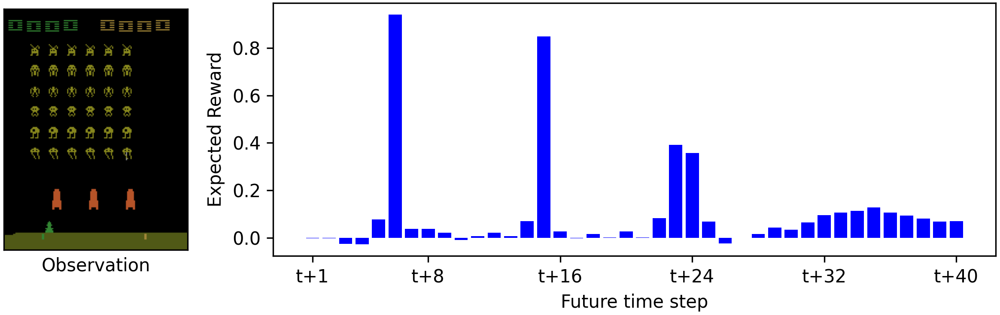
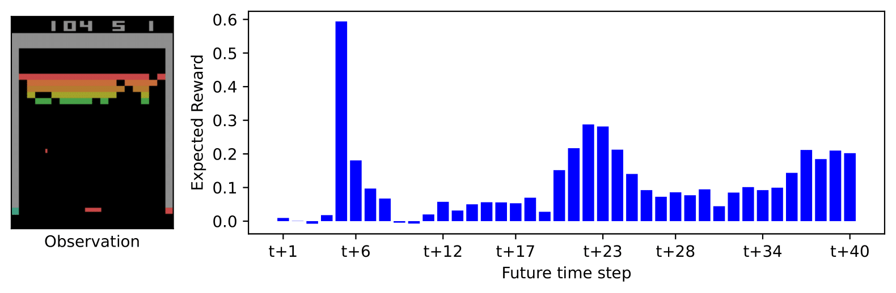
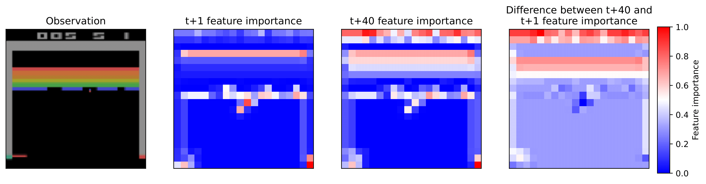
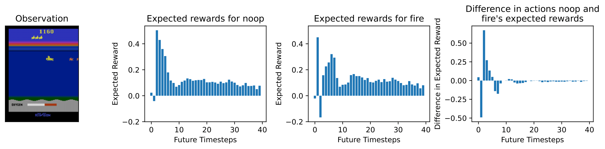

# Explaining an Agent’s Future Beliefs through Temporally Decomposing Future Reward Estimators

Future reward estimation is a core component of reinforcement learning agents, i.e., Q-value and state-value functions, predicting an agent’s sum of future rewards. However, their scalar output prevents understanding when or what individual future rewards an agent expects to receive. We address this by modifying an agent’s future reward estimator to predict their next N expected re wards, referred to as Temporal Reward Decomposition (TRD). This unlocks novel explanations of agent behaviour including when and what quantity rewards the agent expects to receive and their confidence in that, measuring an input feature’s temporal importance on decision-making, and understanding the impact of different actions using their differences in future rewards. Furthermore, we show that DQN agents trained on Atari environments can be efficiently retrained to incorporate TRD with minimal impact on performance.

Add link to ECAI proceedings

## Example explanations
Temporal Reward Decomposition explicitly predicts the agent's next `N` expected rewards providing novel explanatory opportunities. We highlight the three shown in the paper

### What's the future expected rewards?

These figures can be more interesting when the agent's expected rewards over an episode is plotted

https://github.com/user-attachments/assets/6aec532a-8e8f-471b-b7e2-f822e0c7b7fe

https://github.com/user-attachments/assets/ebe08945-9713-4e50-978b-ddabe7384a23

### What observation features influence future rewards?

Utilising saliency map algorithms, we can plot the observation feature importance for individual future rewards rather than the cumulative future rewards like normal

### What's the difference in two actions in terms of future rewards

Using the future expected rewards are explain the differences between two difference actions. 

## Project structure

The training scripts are provided in `temporal_reward_decomposition` with the default hyperparameters and for the QDagger based algorithms request the pre-trained DQN models to be downloaded. See the `dqn-models/readme.md` for more detail.

Trained TRD models are provided in `trd-models`

## Citation

todo
